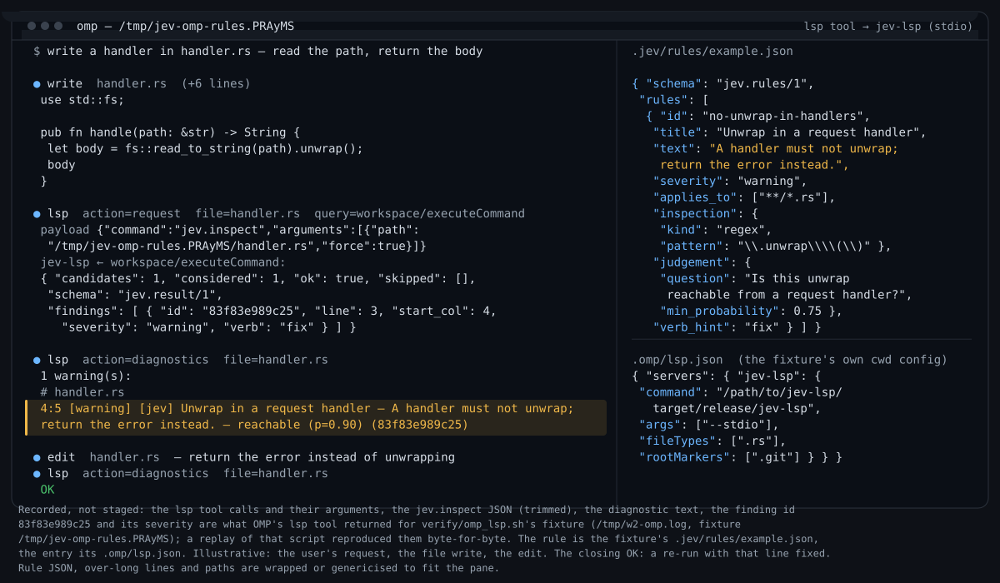
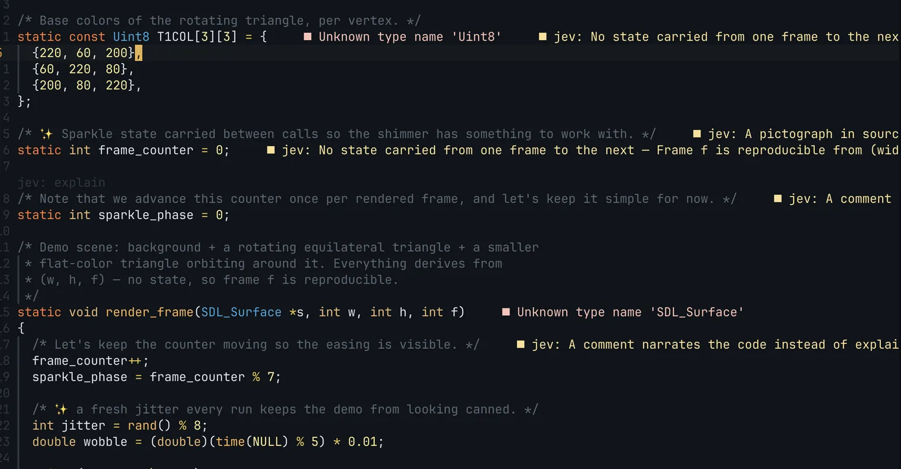
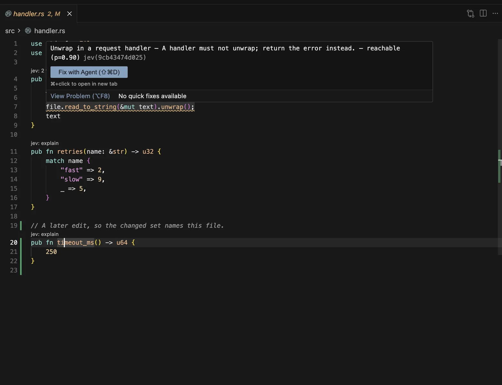

# jev-lsp

> [!WARNING]
> **Heavily work in progress.** The interface, the contract and the
> configuration keys may change without notice; nothing here should be relied on yet.
> this is PoC and heavily under slop-generating phases to proof that lsp approach actually work first


<sub><b>OMP</b>, a third-party LSP client: the rule's finding on the generated line steers the fix.</sub>


<sub><b>Neovim</b>, the primary client: jev's annotations beside the code, next to clangd's own diagnostics.</sub>

## What it is for

**Jev is a classifier, not a chat model.** A rule asks one typed question about one line, and Jev
answers with a value and a probability, never prose. The rule is your own words plus a
deterministic pattern that names the exact lines; the per-line pass or fail is a model answer,
repeatable to within a measured spread. That is what makes a rule semi-deterministic: the pattern
is exact, the judgement is a probability, and the probability has to clear the rule's own floor
before anything is published.

The workflow it carries:

1. **Plan or spec.** You, with coworkers or an LLM, write down what the code has to do.
2. **Rules.** Turn that spec into `.jev/rules/*.json` — in the repository, under version control,
   reviewed like code.
3. **Steering.** jev-lsp applies the rules while you edit by hand, or while a harness generates
   code, so the findings arrive where the code is: on the line, in the client you already use.
4. **On track.** The codebase keeps matching the requirements, and a harness that reads diagnostics
   picks the steering up.

A person or an agent can do that review by hand. jev-lsp moves it into the loop: every save, every
file, in whatever client you work in.

What it is not: it does not know your spec unless a rule carries it, it answers the question in the
rule and nothing else, and it is not a correctness oracle. With no rules there are no ambient
findings and the pass reports `no_rules` — the workflow starts by writing one. The clients it is
exercised by are Neovim through the plugin, the spec-derived client in `verify/lsp_client.py`, and
OMP; a client that reads diagnostics is the whole requirement.

An LSP server that runs a model over the files you have open and reports through your editor's
own surfaces: diagnostics, code actions, code lens. The ambient pass runs the rules your
repository states in `.jev/rules/*.json`; each line a rule points at is sent to **Jev**, a
decision model that returns one answer per question with a probability, not prose. Standard LSP
surfaces only. Neovim is the primary client; `nvim/` is the plugin.

### What it costs

**Well-defined rules are what let you use a local model.** The conventions live in the rule set
instead of in a long instruction document re-sent every turn, so the model no longer has to hold
your project in its head — and what it must produce per change drops from a review of the file to an
answer about one line, roughly 500 tokens in and 30 out. Measured here on 2026-09-20 (rules pass:
`jev inspect --force`, decide tier `jev-1.13`; review: `jev review`, `gemini-2.5-flash-lite`):

| | rules pass | chat review, same file |
|---|---|---|
| `crates/jev-lsp/src/server.rs`, 2.6k lines | 5,341 in / 345 out — 13 candidates, 2 findings, $0.00022 | 30,562 in / 9 out — 0 findings, $0.00306 |
| all 30 `crates/**/*.rs` documents | 82,478 in / 3,831 out — 140 candidates, 20 calls, **$0.0034** | — |

Ten of those 30 documents had no candidate and cost nothing: a save where no rule's pattern matches
makes no call at all. Prices are measured, not assumed — $0.0395 per million tokens from the
decisions route's own `usage.cost`, $0.10 in / $0.40 out per million from the chat tier's
`cost_details`.

Two things this is not. It does not pay for the generation itself — the code your harness writes is
untouched, and the chat tiers (actions, plans, explanations) stay the expensive path, on demand by
design. And local is cheap per token, not fast: this machine generates at 33 tok/s on a small MoE
but its serving logs sit at ~1.5–2 tok/s for the larger code models, which is why a local model
becomes *viable* when the tokens it must produce drop — not because it got quicker. **No local
decide tier has been run end to end here**; `docs/MODEL.md` §7 has the method and the full table,
§8 the local routes.

## Use it

Neovim is the primary client. There is no release page yet, so the binary comes from `cargo
install`, which needs a Rust toolchain (1.75 or later):

```sh
cargo install --git https://github.com/makefunstuff/jev-lsp --locked jev-lsp jev
```

That puts `jev-lsp` (the server) and `jev` (a CLI) in `~/.cargo/bin`, which is on `PATH` for a
normal toolchain install. `git clone` plus `cargo build --release` produces the same two binaries
under `target/release/`. `cargo binstall`, a Homebrew formula and a published `.vsix` do not exist
yet.

Two further things stand between an install and a first finding: the plugin, and a decision-tier
endpoint that answers.

```sh
# 1. the plugin: the attach pass that covers files Neovim cannot identify, the keymaps and :Jev
ln -s /path/to/jev-lsp/nvim ~/.local/share/nvim/site/pack/jev/start/jev
```

```lua
-- 2. in your config; with `jev-lsp` on PATH, the command is the plugin's own default
require('jev').setup({})
```

A lazy-managed config takes the same plugin as a local `dir` spec instead of the symlink:
`{ dir = '/path/to/jev-lsp/nvim', name = 'jev', lazy = false, config = function() require('jev').setup {} end }`.
Without the plugin, Neovim's own client reaches the same surfaces — findings, edits and every
command — in two lines, and `filetypes` is then the client's job:

```lua
vim.lsp.config('jev', { cmd = { 'jev-lsp' }, filetypes = { 'rust' }, root_markers = { '.git' } })
vim.lsp.enable('jev')
```

3. Write a rule in `.jev/rules/*.json`, open a file and save. A finding appears on the line when
the rule's inspection and the decision tier both accept it; with no rule files the pass publishes
nothing and reports `no_rules`. `docs/TUTORIAL.md` §3 writes the first one, and `docs/GUIDE.md` §4 has the full schema.

### Endpoints

Nothing is published until the decision tier answers. It is hosted Jev by default
(`api.typesafe.ai`, key from `TYPESAFE_API_KEY`):

```sh
export TYPESAFE_API_KEY=…
```

The other routes — OpenCode Zen, OpenRouter, a local System One server — and the `wire` and
`timeout_ms` traps that go with them are in `docs/MODEL.md` §8. The chat tiers answer actions,
plans and explanations rather than findings, and are needed only for those:

```sh
export JEV_BASE_URL=http://127.0.0.1:8080/v1   # chat model, OpenAI-compatible
export JEV_MODEL=your-model-name
export JEV_API_KEY_ENV=OPENROUTER_API_KEY      # a hosted chat tier: the NAME of the key variable
```

## Use it with another LSP client

`jev-lsp --stdio` is a language server, so any client that can start one can use it. The plugin
is optional: without it you still get findings (pull diagnostics plus
`workspace/diagnostic/refresh`), edits (`codeAction`, `codeAction/resolve`) and every command
(`workspace/executeCommand`, including `jev.inspect`). What the plugin adds is Neovim-specific
only: the attach pass, the keymaps, `:Jev`.

The server reads its endpoints from the environment it is started with, so export
`JEV_BASE_URL`, `JEV_MODEL`, `JEV_DECIDE_BASE_URL`, `JEV_DECIDE_MODEL` and `JEV_DECIDE_WIRE`
before launching the harness, or set them in the client's server block if it has one.

OMP, the entry `verify/omp_lsp.sh` exercises, written to `<project>/.omp/lsp.json` (or
`~/.omp/agent/lsp.json` to apply it to every project). OMP answers the server's
`workspace/configuration` pull with `settings.jev`, so the entry can carry the endpoints:

```json
{"servers":{"jev-lsp":{"command":"/path/to/jev-lsp/target/release/jev-lsp","args":["--stdio"],
  "fileTypes":[".rs",".py",".md",".toml",".json",".lua",".sh"],"rootMarkers":[".git"],
  "settings":{"jev":{"models":{"decide":{"wire":"system_one","base_url":"https://opencode.ai/zen/v1",
                                          "model":"jev-1.13","api_key_env":"TYPESAFE_API_KEY",
                                          "timeout_ms":15000}}}}}}}
```

`settings` can name the key's **variable** (`api_key_env`) but cannot carry the key itself, so
export it before the harness starts (`export TYPESAFE_API_KEY=…`); without it a hosted decision
call fails with `model_error`. Environment variables win over the `settings` block, which is what
lets the stub and local-server recipes work without editing the client config.

OpenCode, from its schema (`https://opencode.ai/config.json`, `lsp`), where `command` is an
array and `env` carries the endpoint variables:

```json
{"lsp":{"jev-lsp":{"command":["/path/to/jev-lsp/target/release/jev-lsp","--stdio"],"extensions":[".rs"],
                    "env":{"JEV_DECIDE_BASE_URL":"http://127.0.0.1:8009/v1","JEV_DECIDE_MODEL":"kev-latest"}}}}
```

Cursor has no settings-only route for a language server — `.cursor/mcp.json` configures MCP tools,
a different protocol — so it needs the extension in `editors/cursor/`:

```sh
ln -s "$PWD/editors/cursor" ~/.cursor/extensions/makefunstuff.jev-0.1.0   # from a clone; reload the window
bash editors/cursor/pack.sh /tmp/jev-0.1.0.vsix                           # or as a .vsix (verified here)
/Applications/Cursor.app/Contents/Resources/app/bin/cursor --install-extension /tmp/jev-0.1.0.vsix
```

The minimum for a finding is the decide endpoint and the key — the key's *value* comes from a file,
never a setting — and the whole recipe, including what Cursor's API does not do, is `docs/CURSOR.md`:

```jsonc
{
  "jev.server.path": "/path/to/jev-lsp/target/release/jev-lsp",
  "jev.decide.baseUrl": "https://api.typesafe.ai/v1",
  "jev.decide.model": "jev-latest",
  "jev.decide.wire": "system_one",            // system_one | open_router
  "jev.decide.apiKeyEnv": "TYPESAFE_API_KEY", // the NAME of the variable, never the key
  "jev.decide.apiKeyFile": "~/.bash_profile"  // where the key's VALUE is read from
}
```


<sub><b>Cursor / VS Code</b>, a client that is neither Neovim nor the harness: jev's finding in the hover, the squiggle on the line, and <code>jev: explain</code> as an inlay hint.</sub>

Other harnesses keep the same three things in their own file: a command, the extensions it
applies to, and a root marker.

## This repository uses it

The project checks itself with jev. `~/.omp/agent/lsp.json` registers
`target/release/jev-lsp` for OMP on this machine (absolute path, `--stdio`, `fileTypes`,
`rootMarkers`, hosted Jev in a `settings` block), so a rule finding reaches OMP's own `lsp` tool
with no project config, and the conventions this code is checked against live in
`.jev/rules/*.json` — saving a file runs the pass over it. With hosted Jev the key has to be
exported as `TYPESAFE_API_KEY`; measured over this repository's own code the rules publish
**zero** findings at the floors they ship (at the 0.75 floor the unwrap rule once shipped, two
lines of one file published), and 12 of its 30 Rust files had no candidate.

## What you get

| key | |
|---|---|
| `<leader>ja` | the code-action picker; in visual mode the selection is the scope |
| `<leader>ju` | undo the last applied edit |
| `<leader>jq` | ask a question about the file |
| `<leader>js` | status: queue, budgets, endpoints in force |

`:Jev inspect` reports what the rules pass did for the current file: the counts, the findings,
and every skip, so "no finding" can be told apart from "nothing ran". `:Jev inspect --force`
re-runs it for a file git reports as unchanged. Other subcommands are reachable by typing;
`:Jev <Tab>` completes them. The plugin requires Neovim ≥ 0.12.

## Read more

Two reader-facing documents, and then the record:

- **`docs/TUTORIAL.md`** — the first run, end to end: install, the endpoints, one rule, a save, the
  finding, the fix, and the workflow the rules carry. Start here.
- **`docs/GUIDE.md`** — the reference for afterwards: surfaces and keys, where a report goes,
  settings and environment variables, the `jev.rules/1` schema, budgets, the CLI, troubleshooting,
  and what lives on disk.

Per client and per subject:

- `docs/CURSOR.md` — Cursor: the extension, the settings, and what its API does not do
- `docs/UX.md` — the surfaces, and the decisions behind them (noise policy, approval, the plan buffer)
- `docs/MODEL.md` — the tiers, routing, the decision wire, the provider routes, what a pass costs, and what leaves your machine
- `docs/LANGUAGE.md` — unconditional support: the attachment ladder, language resolution, scope, gates
- `docs/ARCHITECTURE.md` — components, process topology, the document store, the scheduler

The contract, the evidence, and the record:

- `PROTOCOL.md` — **frozen**: the LSP method surface, the command list, artifact schemas, the CLI, exit codes
- `docs/VERIFICATION.md` — how each claim is proven, which harnesses prove it, and what is unverified
- `STATUS.md` — project state, decisions taken, and the dated log
- `docs/ROADMAP.md` — the units of work and their acceptance criteria
- `docs/STYLE.md` — the register these documents are written in

The verification table is one command: `bash verify/run-suite.sh /tmp/suite.log`.
