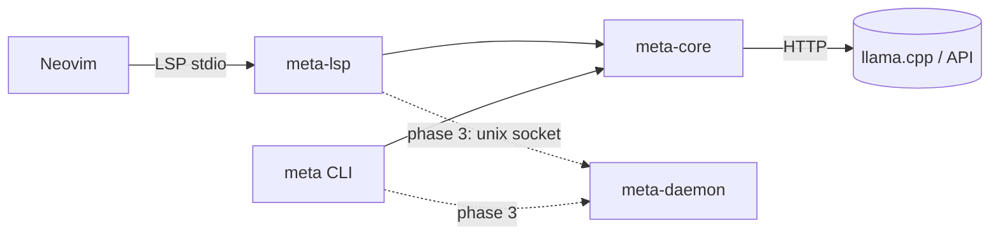
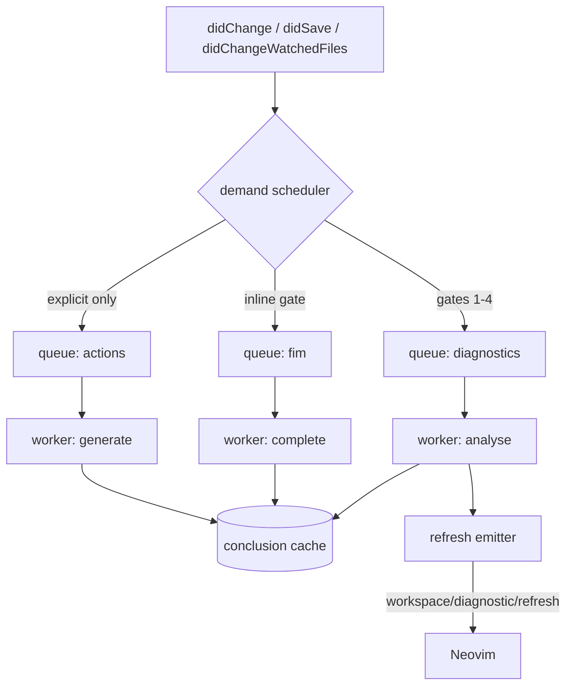

# Architecture

## 0. Shape

Three processes at most, and only in the final phase.



Phases 1 and 2 have no daemon. `meta-lsp` is a plain stdio server owned by Neovim; when
Neovim exits, it exits. The daemon exists only to make the conclusion cache and the repo
index survive restarts.

## 1. Crates

```
crates/meta-core/     no async, no LSP, no tokio. Everything testable in-process.
  types.rs            Verb, Tier, ActionData, Finding, TextOp, Proposal, DocRef, ScopeRef
  lang.rs             language resolution ladder + per-language profiles (docs/LANGUAGE.md)
  scope.rs            scope resolution: treesitter -> structural -> whole file
  document.rs         document mirror, content hashing, incremental change application
  context.rs          context builder: scope text, surroundings, findings, heading
  contract.rs         model output schemas, JSON extraction, repair-facing errors
  verbs.rs            prompt construction per verb, schema + rules
  edit.rs             anchored replacement -> validated TextOp list (the §8 guarantees)
  findings.rs         anchored findings -> positioned, identified, dismissible findings
  gates.rs            binary / size / ignore / line-count gates, with a stated reason
  model.rs            tier config, OpenAI-compatible client, response parsing
  cache.rs            content-hash keyed conclusion cache
  budget.rs           call and token accounting, checked before the call
  config.rs           typed configuration, deep merge, environment override

crates/meta-lsp/      tower-lsp + tokio
  main.rs             stdio transport, argument handling
  server.rs           capabilities, document sync, codeAction, resolve, diagnostic, commands
  engine.rs           orchestration: gates, budget, cache, prompt, model call, validation
  state.rs            documents, generations, cache, budget, config, analysis slot

nvim/lua/meta/        Lua
  init.lua            plugin entry: config, keymaps, :Meta
  attach.lua          universal attach pass and the get_language_id hook
  health.lua          :checkhealth meta

verify/               independent harness (see verify/probes/README.md and VERIFICATION.md)
  probes/             protocol probes against the client runtime, no server needed
  lsp_client.py       independent spec-derived conformance client
  stub_model.py       scripted OpenAI-compatible endpoint, no GPU
  smoke.py            fast end-to-end pre-flight
  nvim_live.lua       the live Neovim test
```

Rule: `meta-core` never learns about LSP, `meta-lsp` never contains prompt text, `nvim/`
never builds context. The one-shot CLI (`crates/meta/`) is specified in PROTOCOL §11 and
**not built yet**; the roadmap carries it as U8.

## 2. Document store and versions

The client owns text. The server keeps:

```rust
struct Document {
  uri: Uri,
  version: i32,        // from didOpen/didChange; also used to stamp edits
  text: Rope,          // mirror, for scope resolution and hashing
  content_hash: Hash,  // sha256 of text; the cache key component
  findings: Vec<Finding>,
  conclusions: ConclusionSet,  // ready actions for this content_hash
}
```

`content_hash` — not `(uri, version)` — keys the cache. Two editors holding the same file
at different versions share one cache entry; a file reverted to earlier content hits its
old entry. Cache entries are `Arc`-shared and immutable.

Version discipline: every asynchronous result records the `(uri, version, content_hash)` it
was computed against. It is discarded on delivery if the live version differs — that is
`state = "stale"`, and per PROTOCOL §8 no edit is returned for it.

## 3. Scheduler

One worker task per analysis kind, each with its own queue and concurrency limit. Nothing
is unbounded.



Properties:

- **Coalescing.** A newer request for the same document cancels the queued older one
  before it starts. Inline completion additionally drops in-flight requests whose prefix
  is no longer a prefix of the current line — the client does this on `InsertLeave`, the
  server does it on delivery.
- **Cancellation.** `$/cancelRequest` maps to a cancellation token threaded through
  `meta-core`, so an aborted HTTP call is dropped rather than awaited.
- **Refresh, not push.** The worker never publishes conclusions directly; it invalidates
  and asks the client to re-pull. Keeps the client's state authoritative and avoids
  double-rendering.
- **A superseded run still refreshes.** The refresh for the interrupted content can arrive
  *before* the refresh for the content the client now holds, so a client must re-pull on
  every refresh, bounded, and stop when the report describes what it holds. A client that
  pulls once per save loses findings; `verify/supersede_probe.py` pins this, and the
  independent client had exactly that bug.
- **Budgets.** `budget.rs` holds the counters. A worker task checks out a permit before
  issuing a call and returns it on completion; refusal is a normal, non-error path.
- **Backpressure.** Each queue has a depth cap (default 4). Beyond that, new work is
  dropped with a debug log — the next change re-requests it anyway.
- **Progress.** The worker reports `begin`/`report`/`end` only under a token obtained per
  PROTOCOL §3.5, never a self-minted one. `end` is emitted by a drop guard in `bridge.rs`,
  so cancellation, model error, budget refusal, and panic all close the token exactly once.

## 4. Latency budgets

| Path | Budget | Mechanism |
|---|---|---|
| `codeAction` | p99 < 50 ms | cache read only, no model, no disk |
| `codeAction/resolve` | p50 < 2 s, cap 30 s | cache hit or one generation |
| `textDocument/diagnostic` | p99 < 30 ms | cache read |
| `textDocument/hover` (hit) | p99 < 100 ms | cache read |
| `textDocument/hover` (miss) | immediate | returns signature, warms cache, no block |
| `inlineCompletion` | p50 < 150 ms | small FIM model, server-side idle floor |
| Startup to first `initialize` result | < 20 ms | no index load on the critical path. No filesystem scan, no classification |
| Language resolution | p99 < 50 µs | `docs/LANGUAGE.md` §6 — table lookups; cached by `(uri, content_hash)`; never calls a model |
| Scope resolution | p99 < 1 ms | treesitter query, else the structural scan, else whole file |
| Notification handling (`didChange`) | < 2 ms | hash + version bump only; no analysis inline |

The rule the table encodes: **no user-visible request ever waits on a model.** Everything
expensive is either precomputed or deferred to a resolve the user opted into by picking.

## 5. Concurrency

- `meta-lsp`: tokio runtime; all `meta-core` calls go through `spawn_blocking` so the
  single `ureq` HTTP implementation is reused and no `async` leaks into `meta-core`.
- Worker tasks are `tokio::spawn`ed loops over a `mpsc` channel each; the concurrency cap
  is enforced by the number of receivers, not by a semaphore bolted on later.
- Shared state is `RwLock<Store>` for documents and `Mutex<Budget>` for counters. No
  `Arc<Mutex<Everything>>`.

## 6. Daemon (phase 3, optional)

Motivation: restarting Neovim currently discards the warm conclusion cache and any index.
Shape, following clangd and rust-analyzer: the stdio binary stays a thin shim that
proxies to a per-workspace daemon over a unix socket, spawning it if absent.

Constraints, so this does not become a second source of truth:

- The daemon stores **only** derived data: conclusions, the repo index, the dismissal
  file. Never document text beyond the cache entries' own content hashes.
- Cache files live under `~/.cache/meta/<workspace-id>/`, `workspace-id` derived from the
  canonical root path, mode `0700`, and are deletable at any time without correctness
  impact.
- Multiple clients may connect; each request carries its own document context. Conclusions
  are keyed by content hash, so a second editor never receives another's stale answer.
- The daemon is never required. If it is missing, unreachable, or refuses the socket
  version, the LSP server falls back to in-process caching and logs once.

Not built in phases 1–2.

## 7. Failure modes

| Failure | Behaviour |
|---|---|
| Model unreachable | Actions resolve with no edit; one `window/showMessage` per session; findings unaffected (cache served); CLI exit 1 |
| Model timeout | Resolve returns the action unchanged; client falls back `[R4]`; no error surfaced as a popup |
| Model returns invalid JSON | Bounded repair (2 attempts, `repair.rs`), then the action resolves unchanged and a debug log records the raw output |
| Model returns an edit that will not parse | The edit is dropped, not applied; a `WARNING` finding is published naming the reason |
| Stale target at resolve | Action re-marked `stale`, no edit; the picker offers "recompute" |
| Budget exhausted | `over_budget` state; work continues on cache; recovery is automatic at the window boundary |
| Cache eviction mid-flight | Recomputed; correctness never depends on cache presence |
| Client crashes | Nothing to reconcile — the server holds no authoritative state |
| Document changed post-apply | Re-hash detects divergence → `ERROR` diagnostic naming the prediction mismatch |
