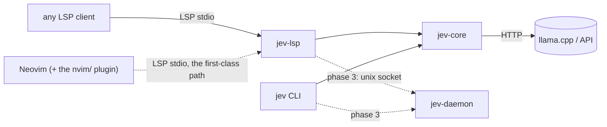
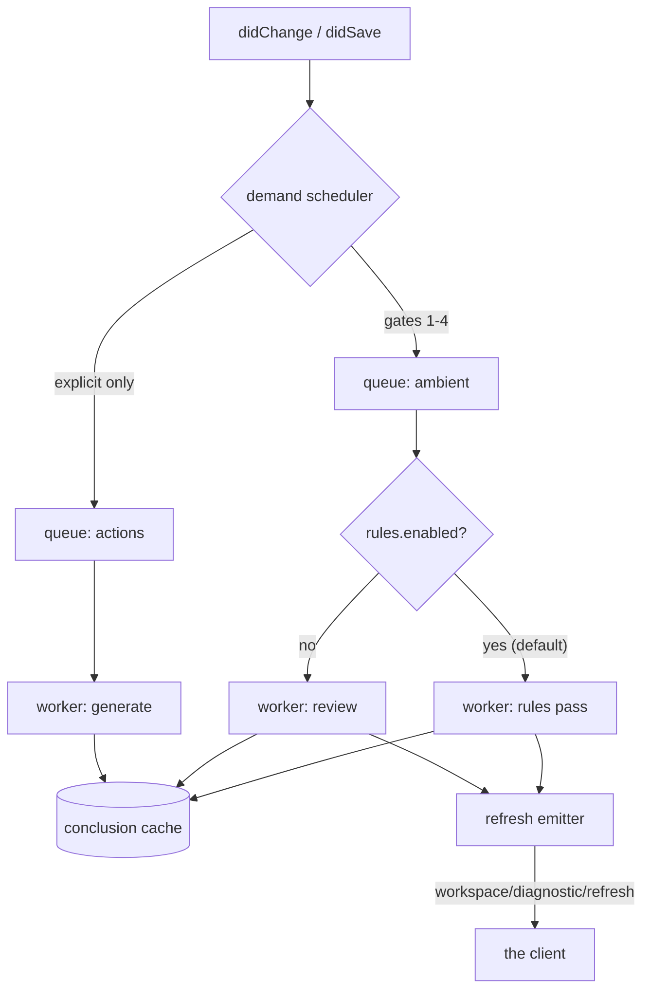

# Architecture

## 0. Shape

Three processes at most, and only in the final phase.



`jev-lsp` is a plain stdio language server: the client owns it, and when the client exits, it
exits. Neovim is the client it is built and verified against (`nvim/` adds the attach pass, the
picker, the lenses' keymaps and `:Jev`), but nothing in the crate below assumes it — OMP and the
spec-derived `verify/lsp_client.py` drive the same surfaces (`docs/LANGUAGE.md` §1,
`docs/VERIFICATION.md` §1). Phases 1 and 2 have no daemon; the daemon exists only to make the
conclusion cache and the repo index survive restarts.

## 1. Crates

```
crates/jev-core/     no async, no LSP, no tokio. Everything testable in-process.
  types.rs            Verb, Tier, ActionData, Finding, TextOp, Proposal, DocRef, ScopeRef
  lang.rs             language resolution ladder + per-language profiles (docs/LANGUAGE.md)
  scope.rs            scope resolution: treesitter -> structural -> whole file
  changed.rs          which files git reports as changed — the rules pass's changed set
  document.rs         document mirror, content hashing, incremental change application
  context.rs          context builder: scope text, surroundings, findings, heading
  contract.rs         model output schemas, JSON extraction, repair-facing errors
  verbs.rs            prompt construction per verb, schema + rules
  edit.rs             anchored replacement -> validated TextOp list (the §8 guarantees)
  findings.rs         anchored findings -> positioned, identified, dismissible findings
  gates.rs            binary / size / ignore / line-count gates, with a stated reason
  rules.rs            the `jev.rules/1` document: load, hash, lint (docs/UX.md §1.1)
  inspections.rs      a rule's inspection -> candidates -> findings, one decision call
  decision.rs         the decision wire: questions in, values out, no prose (docs/MODEL.md §1)
  model.rs            chat tier config, OpenAI-compatible client, response parsing
  fetch.rs            the one page `jev.ask --web` may read (https, 64 KiB, no redirects)
  plan.rs             plan response -> validated plan artifact
  cache.rs            content-hash keyed conclusion cache (§2)
  budget.rs           call and token accounting, checked before the call
  config.rs           typed configuration, deep merge, environment override
  time.rs             RFC 3339 timestamps without a date library

crates/jev-lsp/      tower-lsp + tokio
  main.rs             stdio transport, argument handling
  server.rs           capabilities, document sync, codeAction, resolve, diagnostic, commands
  engine.rs           orchestration: gates, budget, cache, prompt, model call, validation,
                      and the rules pass
  state.rs            documents, generations, cache, budget, config, analysis slots,
                      the changed-set answer, the rules' stats
  trace.rs            the bounded record of what happened, for a red harness to read

crates/jev/          the one-shot CLI (PROTOCOL §11)
  cli.rs              argument grammar, pure: no filesystem, no model, no clock
  run.rs              the commands, including `inspect` over the same rules code
  main.rs             process wiring, exit codes

nvim/lua/jev/        Lua
  init.lua            plugin entry: config, keymaps, :Jev, the picker, artifacts, undo
  attach.lua          universal attach pass and the get_language_id hook
  context.lua         the editor's contribution to a generating request
  picker.lua          the action picker and its preview
  diff.lua            the side-by-side preview
  statusline.lua      the `$/progress`-fed segment
  health.lua          :checkhealth jev

verify/               independent harness (see verify/probes/README.md and VERIFICATION.md)
  probes/             protocol probes against the client runtime, no server needed
  lsp_client.py       independent spec-derived conformance client
  rules_test.py       the rules pass end to end (inspection semantics, gates, skips)
  rules_live.lua      a rule's finding reaching the sign column through the real plugin
  stub_model.py       scripted OpenAI-compatible endpoint, no GPU
  smoke.py            fast end-to-end pre-flight
  nvim_live.lua       the live Neovim test
```

Rule: `jev-core` never learns about LSP, `jev-lsp` never contains prompt text, `nvim/`
never builds context. The one-shot CLI (`crates/jev/`) implements PROTOCOL §11 and shares
`jev-core` with the server — including `inspections`, so `jev inspect` and the ambient pass
cannot disagree about what a rule says (`verify/cli_parity.py`).

## 2. Document store and versions

The client owns text. The server keeps:

```rust
struct Document {
  uri: Uri,
  version: i32,        // from didOpen/didChange; also used to stamp edits
  text: Rope,          // mirror, for scope resolution and hashing
  content_hash: Hash,  // sha256 of text; the cache key component
  findings: Vec<Finding>,
  conclusions: ConclusionSet,  // ready actions for this content_hash
}
```

`content_hash` — not `(uri, version)` — keys the cache. Two editors holding the same file
at different versions share one cache entry; a file reverted to earlier content hits its
old entry. Cache entries are `Arc`-shared and immutable.

**One cache, three keys, and every axis is part of the question.** A conclusion is stored under
each input its answer is a function of, because a key that omits one serves an answer to a
question nobody asked:

```rust
findings_key(content_hash, language, max_findings)   // one analysis covers every scope in a file
rules_key(content_hash, rule_hash, path)             // the rules pass: an edited rule invalidates
op_key(verb, prompt_version, model, language, content_hash, start_line, end_line, context_digest)
```

The language and the cap are in the findings key because they are part of the question — the
review prompt is built from the resolved language's flavour, and what is stored is the *capped*
set — and the path is in the rules key because a rule's `applies_to` is matched against it: two
files with identical bytes and different extensions are asked different questions. The rules key
is what makes a rule edit take effect at all; `op_key` is what keeps a second model, a second
scope or a second project context from being answered with the first one's conclusion.

**Both passes write the same `findings_key` slot**, which is the mechanism behind the one
surprise worth knowing here: editing a rule invalidates the *rules* conclusion but not the
display slot the sign column, the lens and the hint read, so findings already on screen stay as
they were until the next pass for that document — the next save, or the idle trigger
(`docs/UX.md` §1.1). `:Jev recompute` clears the whole cache and re-runs every open document;
`jev.inspect --force` re-runs one document now.

Version discipline: every asynchronous result records the `(uri, version, content_hash)` it
was computed against. It is discarded on delivery if the live version differs — that is
`state = "stale"`, and per PROTOCOL §8 no edit is returned for it.

## 3. Scheduler

One run per document at a time, and a queued request coalesces into a single follow-up pass
rather than a queue of its own: a save that lands mid-analysis asks for one more run, not
twenty. Nothing is unbounded — the state is a per-document slot with `running`/`pending`
(`state.rs`), and `verify/queue_test.py` pins both halves of that.



Properties:

- **Coalescing.** A newer request for the same document cancels the queued older one
  before it starts.
- **Cancellation.** `$/cancelRequest` maps to a cancellation token threaded through
  `jev-core`, so an aborted HTTP call is dropped rather than awaited.
- **Refresh, not push.** The worker never publishes conclusions directly; it invalidates
  and asks the client to re-pull. Keeps the client's state authoritative and avoids
  double-rendering.
- **A superseded run still refreshes.** The refresh for the interrupted content can arrive
  *before* the refresh for the content the client now holds, so a client must re-pull on
  every refresh, bounded, and stop when the report describes what it holds. A client that
  pulls once per save loses findings; `verify/supersede_probe.py` pins this, and the
  independent client had exactly that bug.
- **Budgets.** `budget.rs` holds the counters. A worker task checks out a permit before
  issuing a call and returns it on completion; refusal is a normal, non-error path.
- **Backpressure.** Each queue has a depth cap (default 4). Beyond that, new work is
  dropped with a debug log — the next change re-requests it anyway.
- **Progress.** The worker reports `begin`/`report`/`end` only under a token obtained per
  PROTOCOL §3.5, never a self-minted one. The command body owns both ends of it — `begin`
  before the work and `end` after its value is built — so model errors, budget
  refusals and cancellations close the token exactly once: the failure paths answer with a
  `Result` envelope rather than an early return, and an aborted command unwinds with its guard in
  place. A panic in a command is contained: the body runs in its own task, so the unwind arrives
  as a `JoinError` and the guard armed before `begin` closes the token. A panic anywhere else —
  the transport loop, or a handler that is not spawned — is not contained and takes the process
  down.
- **Two passes, one slot each.** A save resolves to the *rules* pass (the ambient default) or,
  when `rules.enabled` is false, to the review tier; `jev.review` always resolves to the review
  tier, because asking for it is asking for that tier's opinion. Both go through the same
  per-document slot, so a save landing mid-pass still coalesces into one follow-up run, and both
  write the same findings slot in the cache (§2) — which is why `data.source` is what tells two
  findings apart (`docs/UX.md` §1.1).

## 4. Latency budgets

| Path | Budget | Mechanism |
|---|---|---|
| `codeAction` | p99 < 50 ms | cache read only, no model, no disk |
| `codeAction/resolve` | p50 < 2 s, cap 30 s | cache hit or one generation |
| `textDocument/diagnostic` | p99 < 30 ms | cache read |
| `textDocument/hover` (hit) | p99 < 100 ms | cache read |
| `textDocument/hover` (miss) | immediate | returns signature, warms cache, no block |
| Startup to first `initialize` result | < 20 ms | no index load on the critical path. No filesystem scan, no classification |
| Language resolution | p99 < 50 µs | `docs/LANGUAGE.md` §6 — table lookups; cached by `(uri, content_hash)`; never calls a model |
| Scope resolution | p99 < 1 ms | treesitter query, else the structural scan, else whole file |
| Notification handling (`didChange`) | < 2 ms | hash + version bump only; no analysis inline |

The rule the table encodes: **no user-visible request ever waits on a model.** Everything
expensive is either precomputed or deferred to a resolve the user opted into by picking.

## 5. Concurrency

- `jev-lsp`: tokio runtime; all `jev-core` calls go through `spawn_blocking` so the
  single `ureq` HTTP implementation is reused and no `async` leaks into `jev-core`.
- Worker tasks are `tokio::spawn`ed loops over a `mpsc` channel each; the concurrency cap
  is enforced by the number of receivers, not by a semaphore bolted on later.
- Shared state is `RwLock<Store>` for documents and `Mutex<Budget>` for counters. No
  `Arc<Mutex<Everything>>`.

## 6. Daemon (phase 3, optional)

Motivation: restarting the client currently discards the warm conclusion cache and any index.
Shape, following clangd and rust-analyzer: the stdio binary stays a thin shim that
proxies to a per-workspace daemon over a unix socket, spawning it if absent.

Constraints, so this does not become a second source of truth:

- The daemon stores **only** derived data: conclusions, the repo index, the dismissal
  file. Never document text beyond the cache entries' own content hashes.
- Cache files live under `~/.cache/jev/<workspace-id>/`, `workspace-id` derived from the
  canonical root path, mode `0700`, and are deletable at any time without correctness
  impact.
- Multiple clients may connect; each request carries its own document context. Conclusions
  are keyed by content hash, so a second editor never receives another's stale answer.
- The daemon is never required. If it is missing, unreachable, or refuses the socket
  version, the LSP server falls back to in-process caching and logs once.

Not built in phases 1–2.

## 7. Failure modes

| Failure | Behaviour |
|---|---|
| Model unreachable | Actions resolve with no edit; one `window/showMessage` per session; findings unaffected (cache served); CLI exit 1 |
| Model timeout | Resolve returns the action unchanged; client falls back `[R4]`; no error surfaced as a popup |
| Model returns invalid JSON | Bounded repair (2 attempts, `repair.rs`), then the action resolves unchanged and a debug log records the raw output |
| Model returns an edit that would not parse in its language | Nothing detects it: the contract check is structural (anchors locate, nothing duplicates) and the post-apply check is a text comparison, so the edit is applied as the answer wrote it. The real-endpoint harnesses report it (`docs/VERIFICATION.md` §11) |
| Stale target at resolve | Action re-marked `stale`, no edit; the picker offers "recompute" |
| Budget exhausted | `over_budget` state; work continues on cache; recovery is automatic at the window boundary |
| Cache eviction mid-flight | Recomputed; correctness never depends on cache presence |
| Client crashes | Nothing to reconcile — the server holds no authoritative state |
| Document changed post-apply | For an edit the server applied (a plan step): re-hash detects divergence → `ERROR` diagnostic naming the prediction mismatch. A resolved code action records no prediction, so nothing is compared (`docs/VERIFICATION.md` §11) |
